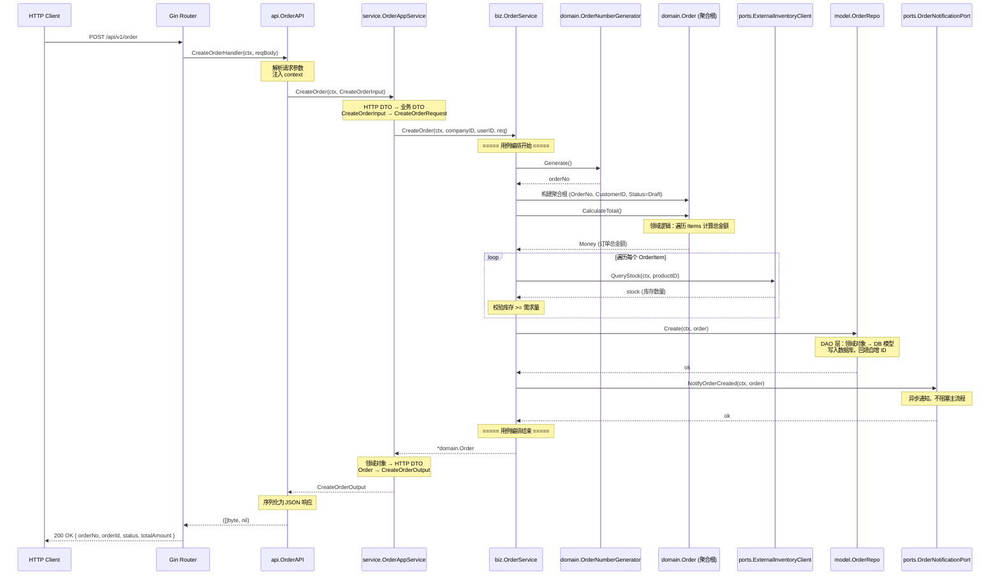

# dd-frame

一个基于 **DDD（领域驱动设计）+ 六边形架构** 的 Go 语言**模块化单体（Modular Monolith）** 项目框架。

以订单领域为完整示例，展示模块化 DDD 分层、端口/适配器解耦、Composition Root 装配等生产级实践。

## 架构概览

```
┌─────────────────────────────────────────────────────────────────────┐
│                          main.go 入口                               │
│              配置加载 · 日志初始化 · DB/Redis · 启动服务器             │
├─────────────────────────────────────────────────────────────────────┤
│                       app/ — 基础设施 & 装配                         │
│   config.go · server.go · database.go · cache.go · logger.go · wire.go│
├─────────────────────────────────────────────────────────────────────┤
│                     middleware/ — 横切关注点                          │
│   recovery · cors · request_id · logger · auth                      │
├──────────────────┬──────────────────┬───────────────────────────────┤
│  example/order/  │ internal/其他模块 │  ... 新增业务模块              │
│  ┌────────────┐  │  ┌────────────┐  │                               │
│  │   api/     │  │  │   api/     │  │  入站适配器（HTTP/gRPC）       │
│  │ service/   │  │  │ service/   │  │  应用边界（DTO 转换）          │
│  │   biz/     │  │  │   biz/     │  │  用例编排（不含业务规则）       │
│  │ domain/    │  │  │ domain/    │  │  核心领域（聚合根/值对象/枚举） │
│  │  model/    │  │  │  model/    │  │  出站适配器（仓储/缓存）        │
│  │  wire.go   │  │  │  wire.go   │  │  模块内 IoC 装配              │
│  └────────────┘  │  └────────────┘  │                               │
├──────────────────┴──────────────────┴───────────────────────────────┤
│                          pkg/ — 共享工具包                            │
│   errors · log · response · pagination                              │
└─────────────────────────────────────────────────────────────────────┘
```

**核心原则：**
- **模块隔离**：每个限界上下文在 `internal/` 下拥有独立 DDD 分层，Go 编译器级别阻止跨模块直接引用
- **端口解耦**：跨模块协作通过端口接口 + ACL 防腐层，不直接导入其他模块
- **Composition Root**：`app/wire.go` 是唯一知道所有模块的装配点
- **依赖方向**：`api → service → biz → domain ← model`，领域层零外部依赖

## 目录结构

```
dd-frame/
├── main.go                              # 应用入口
│
├── app/                                 # 基础设施 & 全局装配
│   ├── config.go                        #   Viper 配置加载 + Config 结构体
│   ├── server.go                        #   Gin HTTP 服务器 + 优雅关闭
│   ├── database.go                      #   GORM + MySQL 初始化
│   ├── cache.go                         #   go-redis 初始化
│   ├── logger.go                        #   Zap 日志初始化
│   └── wire.go                          #   Composition Root：注册所有模块路由
│
├── config/                              # 配置文件
│   ├── config.yaml                      #   默认配置（被 .gitignore 排除）
│   └── config.example.yaml             #   配置示例（提交到仓库）
│
├── middleware/                           # 中间件 — 横切关注点
│   ├── recovery.go                      #   Panic 恢复
│   ├── cors.go                          #   CORS 跨域
│   ├── request_id.go                    #   X-Request-ID 生成
│   ├── logger.go                        #   请求日志（含延迟）
│   └── auth.go                          #   JWT Bearer Token 鉴权
│
├── example/order/                       # 完整订单示例（DDD 六边形架构）
│   ├── domain/                          #   领域层 — 核心业务模型
│   │   ├── entity.go                    #     聚合根 Order + 实体 OrderItem
│   │   ├── value_object.go              #     值对象 Money / OptionalMoney
│   │   ├── enums.go                     #     枚举 OrderStatus / PaymentType / OrderType
│   │   ├── errors.go                    #     领域错误定义
│   │   └── service.go                   #     领域服务接口（定价、订单号生成）
│   ├── biz/                             #   业务编排层 — 用例
│   │   ├── service.go                   #     OrderService 用例编排
│   │   └── ports.go                     #     出站端口接口（支付/库存/通知）
│   ├── service/                         #   应用边界层 — DTO 转换
│   │   └── app_service.go              #     OrderAppService
│   ├── api/                             #   API 层 — HTTP Handler
│   │   └── http_handler.go             #     OrderAPI + 路由注册
│   ├── model/                           #   模型层 — 仓储 & 缓存
│   │   ├── repo.go                      #     OrderRepo 仓储接口
│   │   ├── dao.go                       #     OrderDAO GORM 实现 + converter
│   │   └── cache.go                     #     OrderCache 缓存接口
│   └── wire.go                          #   模块内 IoC 装配 + Stub 端口实现
│
├── internal/_template/                  # 干净模块骨架模板（复制后改名使用）
│   ├── domain/                          #   5 个领域层模板文件
│   ├── biz/                             #   端口接口 + 应用服务模板
│   ├── service/                         #   应用边界层模板
│   ├── api/                             #   HTTP + gRPC handler 模板
│   ├── model/                           #   仓储接口 + 实现 + 缓存模板
│   └── wire.go                          #   模块内 IoC 装配模板
│
└── pkg/                                 # 共享工具包
    ├── errors/errors.go                 #   AppError 统一错误结构
    ├── log/log.go                       #   Zap 结构化日志封装
    ├── response/response.go            #   统一 HTTP 响应 + 错误码映射
    └── pagination/pagination.go         #   分页工具
```

## 核心设计原则

### DDD 战术模式

| 模式 | 对应实现 | 说明 |
|------|---------|------|
| 聚合根 | `example/order/domain/entity.go` → `Order` | 外部访问聚合内对象的唯一入口 |
| 实体 | `Order`、`OrderItem` | 有唯一标识的领域对象 |
| 值对象 | `example/order/domain/value_object.go` → `Money` | 不可变，通过属性值判等 |
| 枚举 | `example/order/domain/enums.go` | 带 `IsValid()` / `String()` 的强类型枚举 |
| 领域服务 | `example/order/domain/service.go` | 跨聚合操作（定价、订单号生成） |
| 领域错误 | `example/order/domain/errors.go` | 携带业务语义的错误定义 |
| 仓储 | `model/repo.go` (接口) + `model/dao.go` (实现) | 接口与实现分离 |
| 端口 | `biz/ports.go` | 定义外部依赖接口（支付、库存、通知） |

### 模块化单体隔离

```
         模块 A (example/order/)         模块 B (internal/product/)
        ┌──────────────────────┐        ┌──────────────────────┐
        │  api → service       │        │  api → service       │
        │       → biz          │   ✕    │       → biz          │
        │           → domain   │ ─ ─ ─ │           → domain   │
        │       ← model        │        │       ← model        │
        │  wire.go (IoC)       │        │  wire.go (IoC)       │
        └──────────────────────┘        └──────────────────────┘
                     │                              │
                     └──────── app/wire.go ─────────┘
                     Composition Root 统一装配
```

- **`internal/` 约定**：Go 编译器阻止外部包导入 `internal/` 下的代码，模块间天然隔离
- **`example/` 目录**：完整示例代码，可参考但不应直接依赖
- **跨模块协作**：通过端口接口 + ACL 防腐层，在 `app/wire.go` 中装配注入

### 分层职责

| 层 | 职责 | 可依赖 |
|----|------|--------|
| `domain` | 核心业务规则，零外部依赖 | 仅标准库 |
| `biz` | 用例编排，协调领域对象与端口 | domain, model/repo, biz/ports |
| `service` | DTO 转换，应用边界 | biz, domain |
| `api` | HTTP/gRPC 请求解析与响应 | service, pkg/response |
| `model/repo` | 仓储接口定义 | domain |
| `model/dao` | 仓储实现（GORM） | domain, model/repo |
| `wire.go` | 模块内依赖装配 | 本模块所有层 |
| `app/wire.go` | 全局 Composition Root | 所有模块 |

## 订单用例流程示例

以 **创建订单** 为例，展示完整调用链：

```
HTTP POST /api/v1/order
    │
    ▼
api.OrderAPI.CreateOrderHandler     ← 解析请求、注入 context
    │
    ▼
service.OrderAppService.CreateOrder ← HTTP DTO → 领域 DTO 转换
    │
    ▼
biz.OrderService.CreateOrder        ← 用例编排：
    │                                  1. 生成订单号 (domain.OrderNumberGenerator)
    │                                  2. 构建聚合根 (domain.Order)
    │                                  3. 计算总金额 (聚合根方法)
    │                                  4. 校验库存   (ports.ExternalInventoryClient)
    │                                  5. 持久化     (model.OrderRepo)
    │                                  6. 发送通知   (ports.OrderNotificationPort)
    ▼
返回 CreateOrderOutput              ← 领域对象 → HTTP DTO
```

### DDD 调用时序图



## 快速开始

### 1. 准备配置文件

```bash
# 复制配置模板
cp config/config.example.yaml config/config.yaml

# 按需修改数据库、Redis 等配置
vi config/config.yaml
```

### 2. 编译 & 运行

```bash
# 克隆项目
git clone https://github.com/example/dd-frame.git
cd dd-frame

# 安装依赖
go mod download

# 编译
go build ./...

# 运行（启动 HTTP 服务器 :8080）
go run main.go
```

### 3. 测试接口

```bash
# 创建订单
curl -X POST http://localhost:8080/api/v1/order \
  -H "Content-Type: application/json" \
  -d '{
    "customerId": 1001,
    "items": [
      {"productId": 1, "quantity": 2, "unitPrice": 9900}
    ]
  }'

# 提交订单
curl -X POST http://localhost:8080/api/v1/order/ORD-xxx/submit

# 取消订单
curl -X POST http://localhost:8080/api/v1/order/ORD-xxx/cancel
```

## 技术栈

| 组件 | 用途 | 包 |
|------|------|----|
| Go 1.26 | 编程语言 | — |
| Gin | HTTP 路由框架 | `github.com/gin-gonic/gin` |
| GORM | ORM 框架（仓储实现） | `gorm.io/gorm` + `gorm.io/driver/mysql` |
| Redis | 分布式锁 & 缓存 | `github.com/redis/go-redis/v9` |
| Viper | 配置解析（YAML + 环境变量） | `github.com/spf13/viper` |
| Zap | 结构化日志 | `go.uber.org/zap` |
| UUID | 请求 ID 生成 | `github.com/google/uuid` |

## 新增模块指南

### 方式一：从模板复制（推荐）

```bash
# 1. 复制模板到 internal/ 下，改名为你的模块
cp -r internal/_template internal/product

# 2. 全局替换 EntityName → 实际领域名（如 Product）
find internal/product -type f -name "*.go" -exec sed -i '' 's/EntityName/Product/g' {} +

# 3. 修改 import 路径
find internal/product -type f -name "*.go" -exec sed -i '' 's|internal/_template|internal/product|g' {} +

# 4. 在 app/wire.go 中注册模块
#    import "github.com/example/dd-frame/internal/product"
#    productAPI := product.Wire()
#    productAPI.RegisterRoutes(v1)
```

### 方式二：参考订单示例

参考 `example/order/` 的完整实现，理解每一层的职责后手动创建。

### 关键约束

- **模块目录必须在 `internal/` 下**，确保 Go 编译器级别的导入隔离
- **模块间不直接引用**，跨模块协作通过端口接口 + ACL 防腐层
- **所有模块在 `app/wire.go` 统一注册**，这是唯一的 Composition Root
