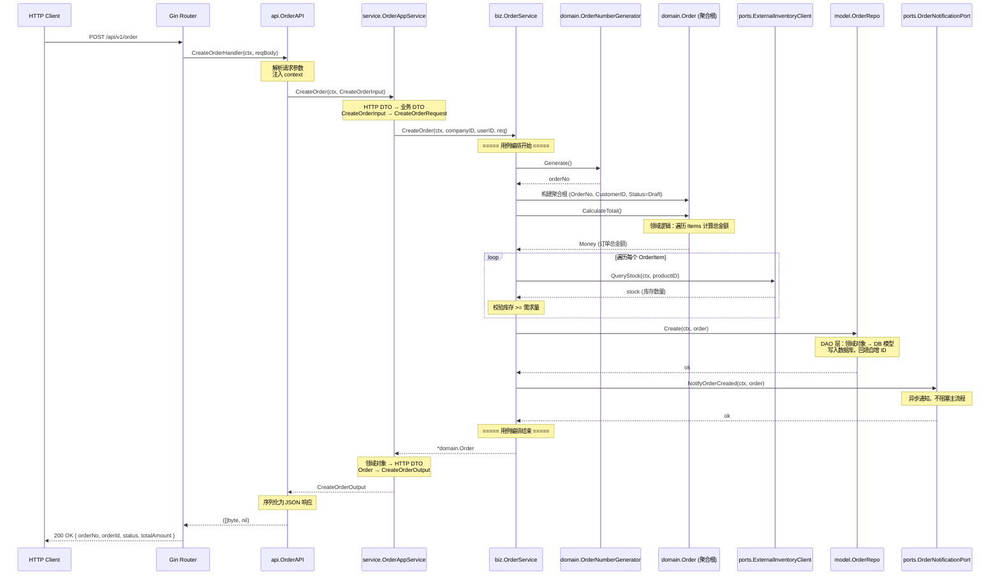

# 架构原理

dd-frame 基于 **DDD（领域驱动设计）+ 六边形架构（端口与适配器）** 构建，采用**模块化单体（Modular Monolith）** 模式。

## 架构总览

```
┌─────────────────────────────────────────────────────────────────────┐
│                          main.go 入口                               │
│     配置加载 · 日志初始化 · 追踪初始化 · DB/Redis · 启动服务器     │
├─────────────────────────────────────────────────────────────────────┤
│                       app/ — 基础设施 & 装配                         │
│ config · server · database · cache · logger · health · tracing · metrics│
├─────────────────────────────────────────────────────────────────────┤
│                     middleware/ — 横切关注点                          │
│ recovery · cors · otelgin · request_id · metrics · logger · auth · rbac│
├──────────────────┬──────────────────┬───────────────────────────────┤
│  example/order/  │ internal/auth    │  ... 新增业务模块              │
│  ┌────────────┐  │  ┌────────────┐  │                               │
│  │   api/     │  │  │   api/     │  │  入站适配器（HTTP/gRPC）       │
│  │ service/   │  │  │ service/   │  │  应用边界（DTO 转换）          │
│  │   biz/     │  │  │   biz/     │  │  用例编排（不含业务规则）       │
│  │ domain/    │  │  │ domain/    │  │  核心领域（聚合根/值对象/枚举） │
│  │  model/    │  │  │  model/    │  │  出站适配器（仓储/缓存）        │
│  │  wire.go   │  │  │  wire.go   │  │  模块内 IoC 装配              │
│  └────────────┘  │  └────────────┘  │                               │
├──────────────────┴──────────────────┴───────────────────────────────┤
│                          pkg/ — 共享工具包                            │
│ auth (JWT+RBAC) · errors · log · response · pagination             │
└─────────────────────────────────────────────────────────────────────┘
```

## 核心设计原则

| 原则 | 说明 |
|------|------|
| **模块隔离** | 每个限界上下文在 `internal/` 下拥有独立 DDD 分层，Go 编译器级别阻止跨模块直接引用 |
| **端口解耦** | 跨模块协作通过端口接口 + ACL 防腐层，不直接导入其他模块 |
| **Composition Root** | `app/wire.go` 是唯一知道所有模块的装配点 |
| **依赖方向** | `api → service → biz → domain ← model`，领域层零外部依赖 |

## DDD 战术模式

| 模式 | 对应实现 | 说明 |
|------|---------|------|
| 聚合根 | `domain/entity.go` → `Order` | 外部访问聚合内对象的唯一入口 |
| 实体 | `Order`、`OrderItem` | 有唯一标识的领域对象 |
| 值对象 | `domain/value_object.go` → `Money` | 不可变，通过属性值判等 |
| 枚举 | `domain/enums.go` | 带 `IsValid()` / `String()` 的强类型枚举 |
| 领域服务 | `domain/service.go` | 跨聚合操作（定价、订单号生成） |
| 领域错误 | `domain/errors.go` | 携带业务语义的错误定义 |
| 仓储 | `model/repo.go` (接口) + `model/dao.go` (实现) | 接口与实现分离 |
| 端口 | `biz/ports.go` | 定义外部依赖接口（支付、库存、通知） |

## 模块化单体隔离

```
         模块 A (example/order/)         模块 B (internal/product/)
        ┌──────────────────────┐        ┌──────────────────────┐
        │  api → service       │        │  api → service       │
        │       → biz          │   ✕    │       → biz          │
        │           → domain   │ ─ ─ ─ │           → domain   │
        │       ← model        │        │       ← model        │
        │  wire.go (IoC)       │        │  wire.go (IoC)       │
        └──────────────────────┘        └──────────────────────┘
                     │                              │
                     └──────── app/wire.go ─────────┘
                     Composition Root 统一装配
```

- **`internal/` 约定**：Go 编译器阻止外部包导入 `internal/` 下的代码，模块间天然隔离
- **`example/` 目录**：完整示例代码，可参考但不应直接依赖
- **跨模块协作**：通过端口接口 + ACL 防腐层，在 `app/wire.go` 中装配注入

## 分层职责

| 层 | 职责 | 可依赖 |
|----|------|--------|
| `domain` | 核心业务规则，零外部依赖 | 仅标准库 |
| `biz` | 用例编排，协调领域对象与端口 | domain, model/repo, biz/ports |
| `service` | DTO 转换，应用边界 | biz, domain |
| `api` | HTTP/gRPC 请求解析与响应 | service, pkg/response |
| `model/repo` | 仓储接口定义 | domain |
| `model/dao` | 仓储实现（GORM） | domain, model/repo |
| `wire.go` | 模块内依赖装配 | 本模块所有层 |
| `app/wire.go` | 全局 Composition Root | 所有模块 |

## 订单用例流程

以 **创建订单** 为例，展示完整调用链：

```
HTTP POST /api/v1/order
    │
    ▼
api.OrderAPI.CreateOrderHandler     ← 解析请求、注入 context
    │
    ▼
service.OrderAppService.CreateOrder ← HTTP DTO → 领域 DTO 转换
    │
    ▼
biz.OrderService.CreateOrder        ← 用例编排：
    │                                  1. 生成订单号 (domain.OrderNumberGenerator)
    │                                  2. 构建聚合根 (domain.Order)
    │                                  3. 计算总金额 (聚合根方法)
    │                                  4. 校验库存   (ports.ExternalInventoryClient)
    │                                  5. 持久化     (model.OrderRepo)
    │                                  6. 发送通知   (ports.OrderNotificationPort)
    ▼
返回 CreateOrderOutput              ← 领域对象 → HTTP DTO
```

### 调用时序图



## 跨模块协作

模块间**不直接引用**，通过端口接口 + ACL 防腐层解耦：

```
模块 A 需要调用模块 B 的能力：
1. 在模块 A 的 biz/ports.go 中定义端口接口
2. 在 app/wire.go 中创建 ACL 适配器，实现模块 A 的端口接口
3. ACL 适配器内部调用模块 B 的 service 层（app/wire.go 是唯一知道所有模块的地方）
4. 将适配器注入模块 A 的 biz 层
```

**依赖规则：**

| 规则 | 说明 |
|------|------|
| 模块间不直接导入 | order 不能 `import "internal/payment/..."` |
| 通过端口接口解耦 | 需求方定义接口，提供方实现 |
| ACL 翻译隔离 | 跨模块调用必须经过防腐层 |
| app/wire.go 装配 | 唯一"知道所有模块"的地方 |

## 中间件链

全局中间件按顺序注册，每个均为独立模块，通过配置开关控制：

```
请求 → Recovery → CORS → otelgin(Tracing) → RequestID → Metrics → Logger
         ↓              ↓                        ↓          ↓        ↓
      panic恢复     跨域处理    自动创建Span     UUID生成   指标采集   日志(含traceID)
```

路由级中间件（按需添加）：

```
/api/v1/*      → RequireAuth (JWT)
/api/v1/user/* → RequireAuth + RequirePermission (RBAC)
```

## 启动流程

```
main.go
  │
  ├── app.LoadConfig()         ← Viper 加载 config/config.yaml
  ├── app.InitLogger()         ← Zap 结构化日志
  ├── app.InitTracing()        ← OpenTelemetry（未启用时 Noop）
  ├── app.InitDatabase()       ← GORM + MySQL（未配置时跳过）
  ├── app.InitRedis()          ← go-redis（未配置时跳过）
  ├── app.Wire()               ← IoC 装配所有模块 + 注册中间件
  │   ├── /health, /ready      ← 健康检查端点
  │   ├── /metrics             ← Prometheus 端点（配置启用时）
  │   ├── /swagger/*           ← Swagger UI（非 release 模式）
  │   └── /api/v1/*            ← 业务路由
  └── app.RunServer()          ← 启动 Gin HTTP（优雅关闭）
```
